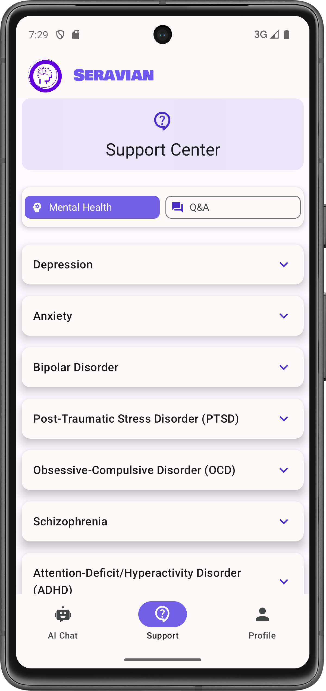
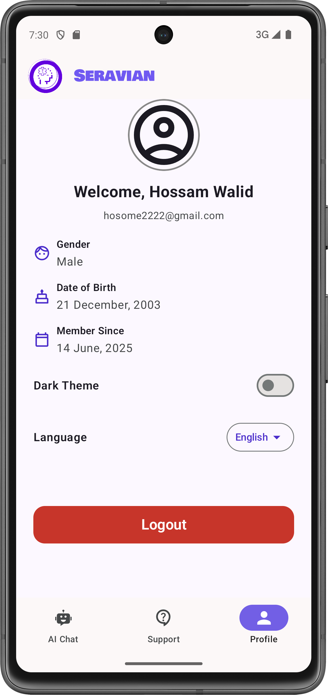
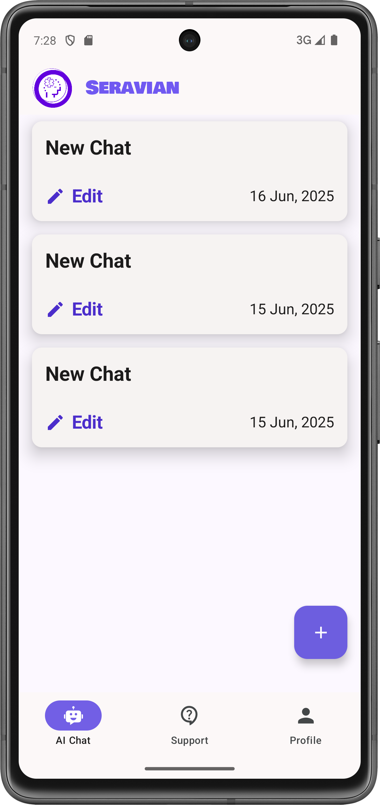
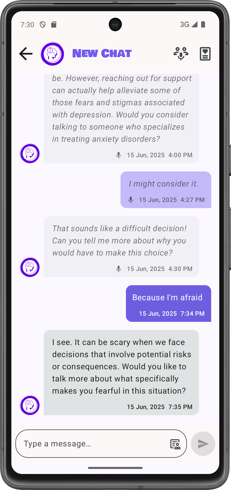
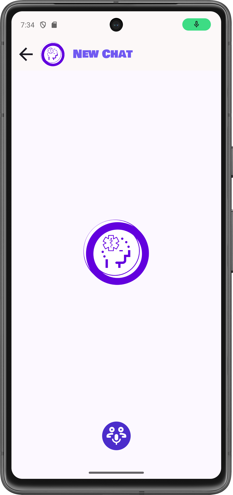
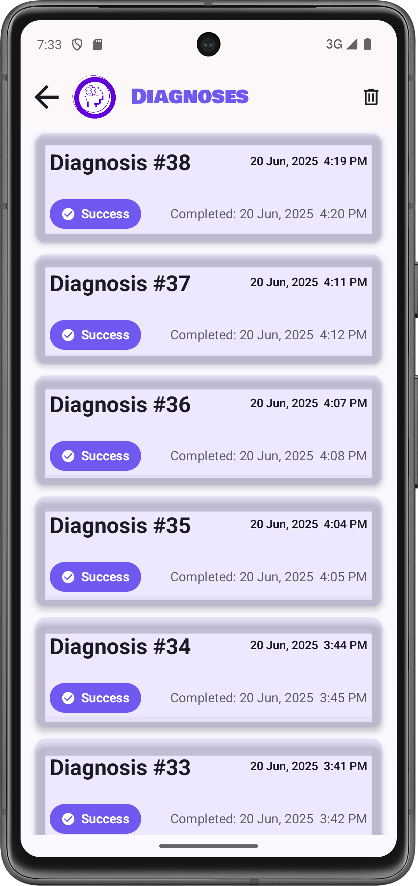
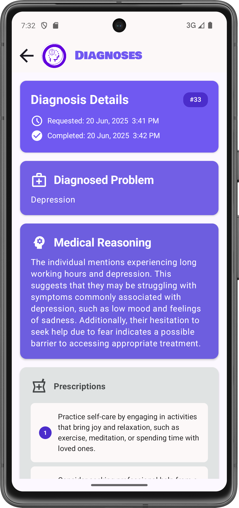

# Seravian – Android Application

This repository contains the **Android mobile application** for **Seravian**, a mental health support platform developed as a **Graduation Project** by Computer Science students (2024–2025).

The Android app provides an intuitive and secure mobile interface for users to access AI-powered mental health support, emotional analysis, and diagnostic tools. It communicates with the Seravian backend API to deliver seamless real-time chat experiences, voice interactions, and comprehensive mental health assessments.

---

## 🛠️ Tech Stack

- **Language:** Kotlin
- **UI Framework:** Jetpack Compose
- **Networking:** Ktor & SignalR Client
- **Dependency Injection:** Koin
- **Navigation:** Compose Navigation 2
- **Local Storage:** Room & DataStore (With Custom JWT Storing Encryption)
- **Image Loading:** Coil 3
- **Architecture:** MVI + Clean Architecture + Feature Based Modularization
- **Backend Integration:** RESTful APIs + Real-time SignalR connections

---

## 📱 App Screenshots

### Core Screens
| Support Screen | Profile Screen |
|:---:|:---:|
|  |  |
| Access help resources and mental support | Manage user profile and account settings |

### Chatbot Feature
| Chats List | Chat | Voice Mode |
|:---:|:---:|:---:|
|  |  |  |
| View all chat history | Real-time messaging interface with AI assistant | Voice-based interaction with speech-to-text |

| Diagnoses List | Diagnosis Details |
|:---:|:---:|
|  |  |
| Browse all mental health assessments and reports | Detailed view of diagnostic results and recommendations |

## 📋 App Features

- **🤖 AI-Powered Mental Health Support** - Advanced conversational AI for emotional support
- **🎤 Voice Interaction** - Natural voice conversations with speech recognition
- **📊 Mental Health Diagnostics** - Comprehensive psychological assessments and reports
- **💬 Real-time Chat** - Instant messaging with intelligent response suggestions
- **🔒 Secure Data Storage** - Encrypted local storage for sensitive health information
- **🌙 Dark/Light Theme** - Automatic theme switching based on system preferences
- **📱 Responsive Design** - Optimized for all Android device sizes and orientations

---

## 💻 Prerequisites

To build and run this project, make sure to have the following dependencies:

- ✅ [Android Studio](https://developer.android.com/studio) (Latest stable version)
- ✅ Android SDK (API Level 26+ / Android 8.0+)
- ✅ Gradle 8.11.1+

## 🧪 Running Locally

1. **Clone the repo:**

   ```bash
   git clone https://github.com/seravian-org/Seravian-App.git
   cd Seravian-App
   ```

2. **Configure API Keys:**
   
   Add in the `local.properties` file in the root directory the following configuration:

   ```properties
   DEV_KEY=development_api_key_here
   DEV_URL=development_server_url_here
   PROD_URL=production_server_url_here
   PROD_KEY=production_api_key_here
   ```

   > 🔑 These properties are used by the `core-network` module to configure API endpoints and authentication for different environments.

3. **Sync Gradle:**
   
   Open the project in Android Studio and let Gradle sync automatically, or run:

   ```bash
   ./gradlew build
   ```

4. **Run the app:**
   
   Connect an Android device or start an emulator, then click **Run** in Android Studio or use:

   ```bash
   ./gradlew installDebug
   ```

---

## 🔧 Configuration

### 🌐 Network Configuration

The app uses a modular network configuration through the `core-network` module:

| Property | Description | Environment |
|----------|-------------|-------------|
| `DEV_KEY` | API key for development environment | Development |
| `DEV_URL` | Base URL for development server | Development |
| `PROD_URL` | Base URL for production server | Production |
| `PROD_KEY` | API key for production environment | Production |

### 🎨 UI/UX Features

- **Modern Material Design 3:** Following latest Android design guidelines
- **Dark/Light Theme Support:** Automatic theme switching based on system preferences
- **Responsive Layout:** Optimized for different screen sizes and orientations
- **Accessibility:** Full support for screen readers and accessibility services
- **Smooth Animations:** Fluid transitions and micro-interactions

---

## 👥 Authors & Ownership

This Android app is part of the **Seravian** GitHub organization, which includes:

- [`Seravian-Web`](https://github.com/Seravian/Seravian-Web) (Angular)
- [`Seravian-Backend`](https://github.com/Seravian/Seravian-Backend) (ASP.NET Core)
- [`Seravian-App`](https://github.com/Seravian/Seravian-App) (Kotlin – Android)
- [`Seravian-AI`](https://github.com/Seravian/Seravian-AI) (FastAPI + Python)

> 📌 **Note:** While the platform is a team project,  
> 📱 **this Android app was collaboratively developed by:**
> - 🧑‍💻 **[Hossam Walid](https://github.com/GreenVenom77)**
> - 🧑‍💻 **[Kareem Essam](https://github.com/Kessam10)**

---

## 📄 License

Elastic License v2.0 – see [`LICENSE`](./LICENSE)

---
